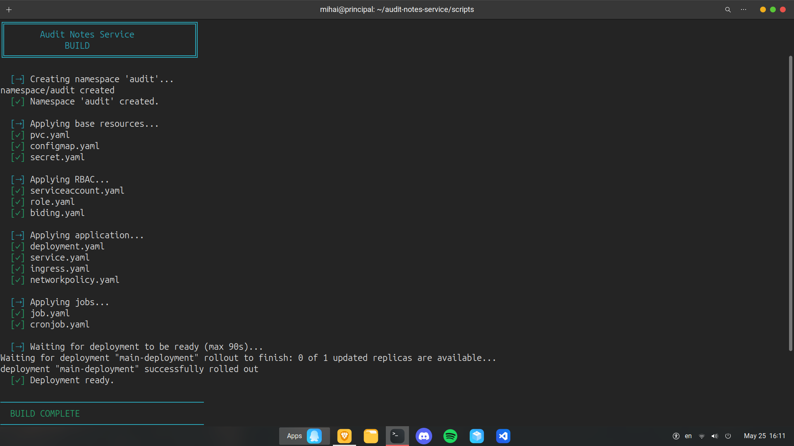
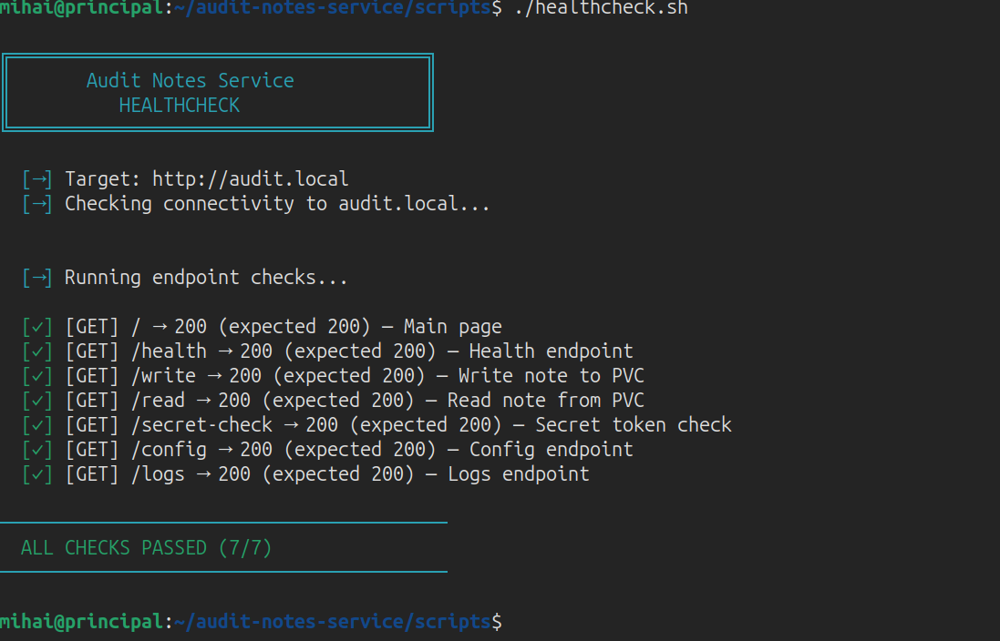
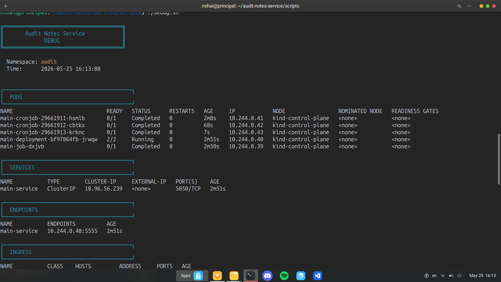
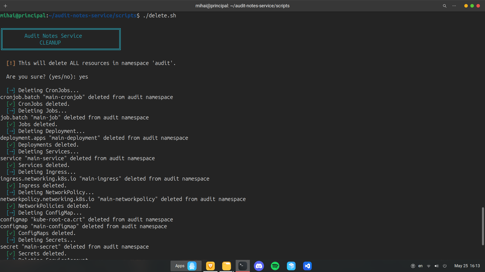

<div align="center">
  
</div>

<br>

<div align="center">
  
  &nbsp;
  
  &nbsp;
  
  &nbsp;
  
  &nbsp;
  
</div>

<br>

---

## 🙋 What is this exactly?

Imagine you write a small app on your laptop. It works fine — on *your* laptop. The hard part isn't writing it. The hard part is: how do you get it running safely, automatically, on a real server, every time you make a change — without breaking anything?

That's what this project is about. It's a tiny note-taking app (you can write a note, read it back, check if it's online) — but the **real point** isn't the app. The point was learning how professional teams actually ship software: test it, package it, store it, deploy it, and keep it running — all automatically, with no one touching a keyboard mid-deploy.

```
You write code  →  it gets tested  →  it gets packaged  →  it gets shipped  →  it runs, safely
```

Every box above is a real, separate skill. This project has all of them, built by hand, one at a time, by actually breaking things and fixing them — not copy-pasted.

---

## 🧩 The 4 big pieces, explained like you're 12

### 1️⃣ The App
A small website (built with **Flask**, a Python tool) that does 3 things: say "I'm alive", save a note, read a note back. Simple on purpose — the app isn't the lesson, everything *around* it is.

### 2️⃣ The Robot That Tests Everything (CI/CD)
Every time I change the code and push it to GitHub, a robot wakes up automatically and does 3 checks, one after another:

```
🤖 Step 1 → "Does the code even work?"        (runs the tests)
🤖 Step 2 → "Does it run inside a container?"  (builds it, starts it, pokes it)
🤖 Step 3 → "Does it work on a real cluster?"   (deploys it, checks it)
```

If **any** step fails, the robot stops immediately and tells me what broke — before it ever reaches anything real. This is called a **CI/CD pipeline**, and the tool doing it is **GitHub Actions**. The whole thing runs on GitHub's own machines, automatically, with nobody sitting at a keyboard.

### 3️⃣ The Warehouse (Docker Registry)
Once the app passes its tests, it gets boxed up into a **container** (think: a shipping container — same box works the same way everywhere) and stored in an online warehouse called **GHCR** (GitHub's container warehouse). Every box gets a label with the exact version, so I always know exactly what's running.

### 4️⃣ The Instruction Sheet (Helm)
The app needs about 11 different settings to run correctly on a cluster (storage, permissions, networking, etc). Instead of setting each one up by hand — slow, and easy to mess up — I wrote one **instruction sheet** that sets all 11 up at once, correctly, every time. That tool is called **Helm**.

---

## 🔄 How it all connects

```text
 1. I push code            git push origin main
        │
        ▼
 2. 🤖 robot tests it       pytest ✅ passed
        │
        ▼
 3. 🤖 robot boxes it        📦 pushed to warehouse (GHCR)
        │
        ▼
 4. 🤖 robot ships it        ⎈ Helm sets everything up
        │
        ▼
 5. App is live              ✅ Running, health-checked, verified
```

If step 2 fails, steps 3-5 never happen. Broken code never reaches a real cluster — that's the entire point of doing it this way instead of by hand.

This entire flow runs **inside GitHub Actions**, automatically. The cluster, the deployment, the health checks — all of it happens on GitHub's servers, not on my own laptop.

---

## 🛡️ What's actually running under the hood (for the curious)

Even though the app looks tiny from outside, here's everything quietly working behind it:

| What | In plain words |
|---|---|
| 🗂️ **Persistent storage** | Notes survive even if the app restarts or crashes |
| 💚 **Health checks** | The cluster constantly asks "are you OK?" and restarts it if not |
| 🔒 **Permissions (RBAC)** | The app can only see what it's allowed to see, nothing more |
| 🚧 **Network rules** | Only the front door (Ingress) can talk to the app — nothing else |
| ⏰ **Scheduled checks** | A little robot checks every minute that the note still exists |
| 📋 **One-time setup job** | Creates the very first note automatically, the first time it runs |
| 👀 **Sidecar logger** | A tiny helper container just for watching logs, sitting next to the app |

---

## 🗂️ Where everything lives

```text
audit-notes-service/
├── image/              ← the actual app (Flask + Dockerfile)
├── helm-chart/          ← the "instruction sheet" (all settings, one place)
│   ├── Chart.yaml
│   ├── values.yaml
│   └── templates/       ← the 11 setup files Helm fills in automatically
├── .github/workflows/   ← the robot's instructions (test → box → ship)
└── scripts/             ← early helper scripts (see note below)
```

---

## 🚀 How it deploys (inside CI/CD)

This now runs entirely inside the pipeline — no manual steps, no local machine involved. On every push to `main`:

```bash
# 1. The robot spins up a temporary cluster
kind create cluster

# 2. The robot logs in to the warehouse and grabs the freshly built image
docker login ghcr.io
docker pull ghcr.io/mihai-minascurta/audit-notes-service:latest

# 3. The robot sets everything up with one command
helm upgrade --install audit-release helm-chart/ \
  --namespace audit \
  --create-namespace \
  --set image.tag=sha-<commit-hash> \
  --wait

# 4. The robot checks it's actually working, then tears the cluster down
```

Nobody runs these by hand anymore — this whole sequence is what `.github/workflows/` triggers automatically.

---

## 🎓 Why I built it this way

I'm learning to become a **DevOps engineer** — someone who makes sure software ships safely and reliably, not just someone who writes code. So instead of a tutorial project, I built something that actually breaks in real ways, and fixed every single break by understanding *why* it happened, not just copying a fix.

The Kubernetes design, the CI/CD pipeline, and the Helm chart were all built and debugged by hand, on my own local machine first, before being moved into full automation.

I also used **AI assistance** throughout this project — mainly to avoid spending hours rewriting repetitive boilerplate (shell scripts, YAML scaffolding) for things I already understood conceptually, so I could spend that time instead on the parts that actually taught me something: debugging real failures, understanding *why* each piece exists, and learning how production systems are actually wired together.

---

## 📸 Early-stage screenshots

These were taken during the **first, local-only version** of this project — before the CI/CD pipeline and Helm chart existed. Back then, everything ran by hand on my own machine with `kubectl`, just to prove the Kubernetes design worked before automating it.

**Everything starting up**


**Checking it's healthy**


**Full system view**


**Cleaning everything up**


---


<div align="center">
  
</div>
